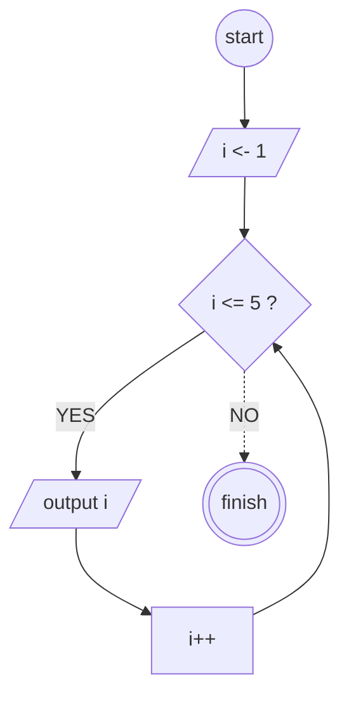

# Algoritma Perhitungan

## Deskriptif

## Pseudo-code

```pseudo-code
DECLARE A : INTEGER
DECLARE B : INTEGER
DECLARE HASIL : INTEGER

INPUT A
INPUT B

HASIL <- A+B

OUTPUT "Hasilnya = ", HASIL


```

### Loop 1-5



```pseudo-code


FOR i <- 1 TO 5
    OUTPUT i
NEXT i

```
