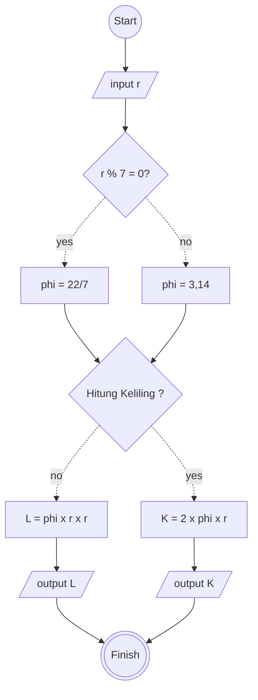

# Menghitung luas & keliling lingkaran

## Algoritma Deskriptif

1. Mulai
2. Masukkan nilai jari-jari lingkaran
3. Jika jari" lingkaran habis dibagi 7, gunakan phi = 22/7
4. Jika tidak, gunakan phi = 3,14
5. Hitung luas Lingkaran = phi x jari" lingkaran x jari" lingkaran
6. Hitung keliling lingkaran = 2 x 3,14 x jari" lingkaran
7. Tampilkan hasil perhitungan luas & keliling lingkaran
8. Selesai

## Flowchart



## Pseudo-code

```pseudo-code
DECLARE r = INTEGER
DECLARE L = INTEGER
DECLARE K = INTEGER
DECLARE phi = INTEGER
DECLARE isLuasCalculate = BOOLEAN

INPUT r

IF r % 7 = 0 THEN
    phi <- 22/7
ELSE
    phi <- 3,14
ENDIF


INPUT isLuasCalculate

IF isLuasCalculate = TRUE THEN
    L <- phi * r * r
    OUTPUT "Hasil Luas= ", L
ELSE
    K <- 2 x phi x r
    OUTPUT "Hasil keliling= ", K
ENDIF

```
