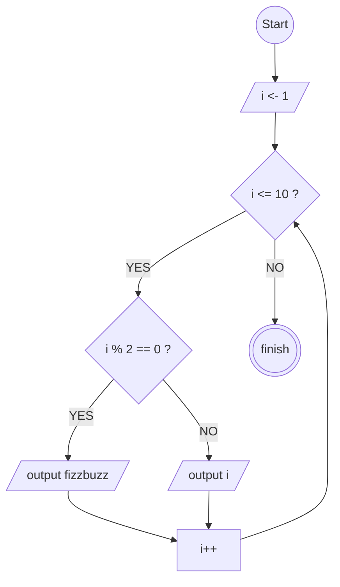

# fizzbuzz muncul di bilangan genap

## FLowchart



## Pseudo Code

```pseudo-code

DECLARE i : INTEGER
i <- 1

FOR i <- 1 TO 10
    IF i % 2 = 0 THEN
        OUTPUT "fizzbuzz"
    ELSE
        OUTPUT i
    ENDIF
NEXT i

```
