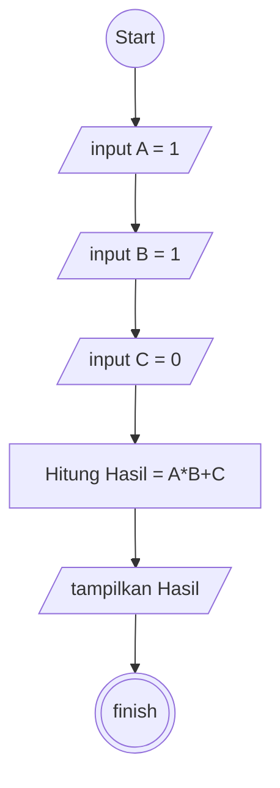

# Perhitungan 1 \* 1 + 0

## Deskriptif

```
1. Mulai
2. Masukkan nilai A = 1
3. Masukkan nilai B = 1
4. Masukkan nilai C = 0
5. hitung nilai hasil A*B+C
6. tampilkan hasil perhitungan
7. Selesai
```

## Flowchart



## Pseudo-code

```pseudo-code

DECLARE A = INTEGER
DECLARE B = INTEGER
DECLARE C = INTEGER
DECLARE HASIL = INTEGER

A <- 1
B <- 1
C <- 0

HASIL <- A*B+C

OUTPUT "Hasil 1+1*0 = ", HASIL

```
