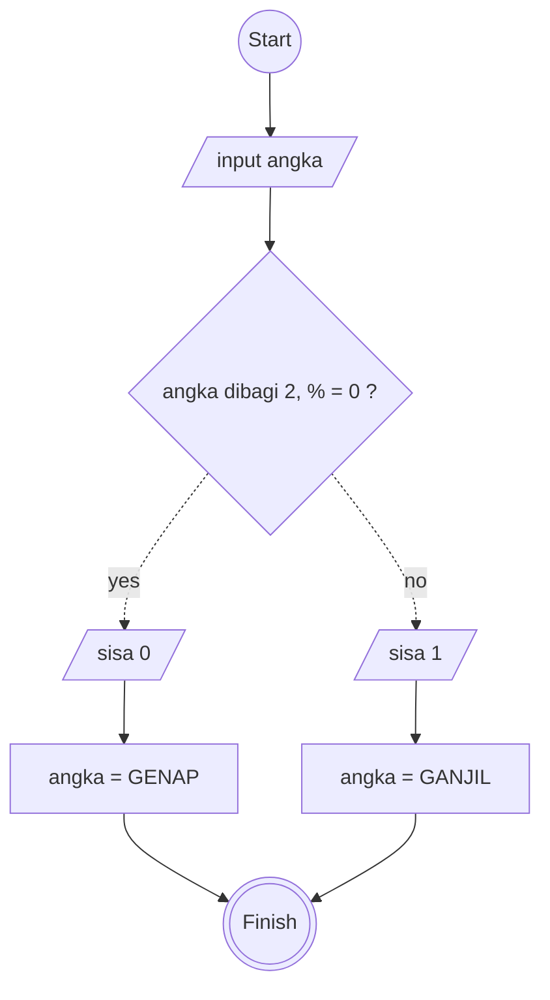

# Minitask Algoritma 2

## Algoritma Deskriptif

```
1. Mulai
2. angka dimulai dari 0 dengan variabel num
3. angka didalam num dibagi 2
4. jika hasil dibagi 2 adalah 0, maka dinyatakan angka genap
5. jika hasil dibagi 2 tersisa 1, maka dinyatakan angka ganjil
6. Selesai
```

## Algoritma Flowchart


