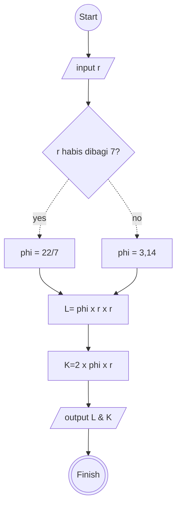

# Menghitung luas & keliling lingkaran

## Algoritma Deskriptif

1. Mulai
2. Masukkan nilai jari-jari lingkaran
3. Jika jari" lingkaran habis dibagi 7, gunakan phi = 22/7
4. Jika tidak, gunakan phi = 3,14
5. Hitung luas Lingkaran = phi x jari" lingkaran x jari" lingkaran
6. Hitung keliling lingkaran = 2 x 3,14 x jari" lingkaran
7. Tampilkan hasil perhitungan luas & keliling lingkaran
8. Selesai

## Flowchart

